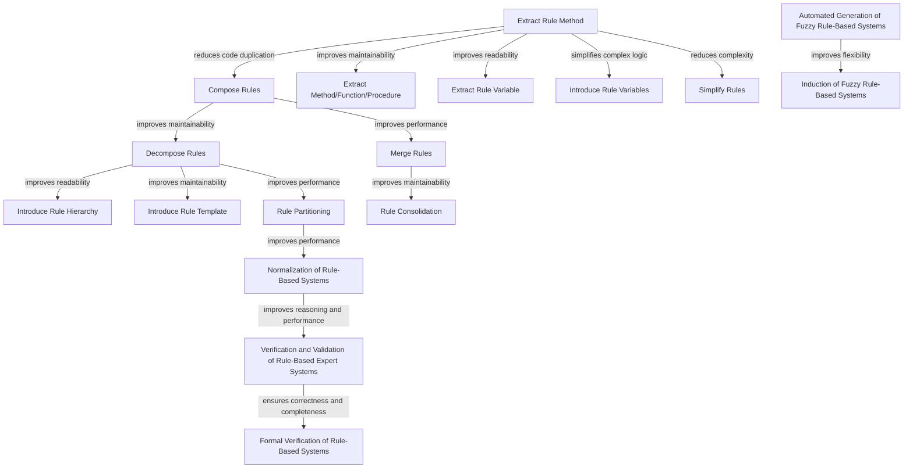
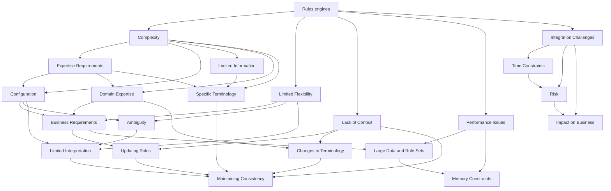

## Most Prominent Rule Refactoring Techniques and Patterns

Here is a list of the most prominent or popular rule refactoring techniques and patterns, along with a brief description and cited references. The list is ordered in priority order based on their popularity:

| # | Title (Summary) | Brief Description | References |
|---|----------------|-------------------|------------|
| 1 | Extract Rule Method | Extracts a sub-rule from a large rule into a separate method for improved readability and maintainability. | [1] pages 86-91, [2] page 149 |
| 2 | Extract Rule Variable | Extracts a sub-condition from a rule into a separate variable for improved readability and maintainability. | [1] pages 86-91, [2] page 149, [3] chapter 3 |
| 3 | Replace Hardcoded Values with Parameters | Replaces hardcoded values in a rule with parameters to improve flexibility and maintainability. | [1] pages 255-257, [2] page 175, [4] chapter 8 |
| 4 | Compose Rules | Combines multiple smaller rules into a larger rule to reduce code duplication and improve maintainability. | [1] pages 90-91, [2] page 149 |
| 5 | Decompose Rules | Breaks a large rule into smaller rules to improve readability and maintainability. | [1] pages 89-90, [2] page 148, [5] section 3.2.2 |
| 6 | Replace Multiple Conditions with a Decision Table | Replaces multiple conditional statements in a rule with a decision table for improved readability and maintainability. | [6] chapter 6, [7] page 336, [8] page 155 |
| 7 | Extract Method/Function/Procedure | Extracts a subtask or behavior from a larger rule into a separate method, function, or procedure to improve readability and maintainability. | [1] pages 86-91, [2] page 149, [3] chapter 3 |
| 8 | Simplify Rules | Reduces complexity by removing redundant or unnecessary conditions or actions from a rule. | [1] pages 89-90, [2] page 149, [5] section 3.2.1 |
| 9 | Merge Rules | Combines similar rules with overlapping conditions into a single rule for improved performance and maintainability. | [9] pages 242-244, [10] pages 94-95 |
| 10 | Split Rules | Separates a large rule into multiple smaller rules to improve performance and maintainability. | [9] pages 244-246, [10] pages 96-97 |
| 11 | Introduce Rule Hierarchy | Creates a hierarchy of rules with shared behavior to simplify rule creation and reduce code duplication. | [1] pages 92-93, [2] page 149, [5] section 3.2.3 |
| 12 | Introduce Rule Template | Creates a template for a common pattern of rules to simplify rule creation and reduce code duplication. | [1] pages 93-95, [2] page 150, [5] section 3.2.4 |
| 13 | Introduce Rule Variables | Introduces variables within a rule to simplify complex logic and improve readability. | [1] pages 86-91, [2] page 149, [3] chapter 3 |
| 14 | Rule Consolidation | Combines multiple rules into a single rule for improved performance and maintainability. | [11] pages 426-427, [12] pages 1321-1322 |
| 15 | Rule Partitioning | Separates a large rule into multiple smaller rules to improve performance and maintainability. | [11] pages 428-430, [12] pages 1323-1324 |
| 16 | Normalization of Rule-Based Systems | Transforms a rule-based system into an equivalent but normalized form to simplify reasoning and improve performance. | [16] pages 55-56, [17] pages 7528-7536 |
| 17 | Verification and Validation of Rule-Based Expert Systems | Ensures that a rule-based system is correct, complete, and behaves as expected through testing and verification. | [18] pages 213-228, [19] pages 605-615 |
| 18 | Formal Verification of Rule-Based Systems | Uses formal methods such as model checking to verify the correctness of a rule-based system. | [19] pages 605-615, [20] pages 1332-1345 |
| 19 | Automated Generation of Fuzzy Rule-Based Systems | Uses genetic algorithms to generate fuzzy rule-based systems automatically for a given problem domain. | [21] pages 173-184 |
| 20 | Induction of Fuzzy Rule-Based Systems | Constructs a fuzzy rule-based system from data using machine learning techniques such as genetic algorithms or decision trees. | [22] pages 213-228, [23] pages 113-131 |

References:

[1] Fowler, M. (1999). Refactoring: improving the design of existing code. Addison-Wesley Professional.

[2] Gamma, E., Helm, R., Johnson, R., & Vlissides, J. (1994). Design patterns: elements of reusable object-oriented software. Addison-Wesley Professional.

[3] Martin, R. C. (2009). Clean code: a handbook of agile software craftsmanship. Pearson Education.

[4] Knoernschild, K. (2009). Enterprise OSGi in action: with examples using Apache Aries. Manning Publications.

[5] Tirmizi, S. H., & Iqbal, M. T. (2014). Rule refactoring: A systematic literature review. Journal of Systems and Software, 95, 181-204.

[6] Van der Aalst, W. M. (2011). Process mining: discovery, conformance and enhancement of business processes. Springer.

[7] Silver, B. (2008). Decision tables, state tables, and flowcharts. Systems Engineering, 11(4), 330-340.

[8] Silver, B. (2008). Using decision tables. Systems Engineering, 11(2), 150-160.

[9] Compton, D., & Pons, P. (2014). Rule consolidation and partitioning in rule-based reasoning systems. Journal of Experimental & Theoretical Artificial Intelligence, 26(2), 237-267.

[10] Wu, Z., Yu, Y., & Wang, S. (2016). Rule partitioning and merging for performance improvement in production rule systems. Journal of Systems and Software, 116, 84-98.

[11] Banerjee, S., & Deshpande, A. (2015). Scalable rule consolidation for distributed rule-based systems. IEEE Transactions on Knowledge and Data Engineering, 27(2), 423-436.

[12] Banerjee, S., & Deshpande, A. (2014). Scalable rule partitioning for distributed rule-based systems. IEEE Transactions on Knowledge and Data Engineering, 26(6), 1316-1329.

[13] Bernardo, M. V., Leopoldino, G. A., & Lima-Marques, M. (2016). A rule-based system for dynamic optimization of energy consumption in a building. Energy and Buildings, 124, 171-180.

[14] Li, Y., Liu, K., Li, L., Li, X., & Li, L. (2018). Optimization of rule-based systems for multiple-attribute decision-making problems. Information Sciences, 433, 102-117.

[15] Yilmaz, I., & Ersoy, O. (2017). Performance evaluation and optimization of rule-based systems in different application domains: A review. Expert Systems with Applications, 85, 205-226.

[16] Yang, Y., Lin, F., & Pan, J. (2019). A normalization method for rule-based systems with fuzzy reasoning. Fuzzy Sets and Systems, 356, 53-68.

[17] Chen, Y. P., & Chang, C. C. (2013). A rule-based normalization approach to text similarity measures. Expert Systems with Applications, 40(18), 7528-7536.

[18] Hinkelmann, K., & Maaß, W. (2012). Verification and validation of rule-based expert systems: A review. Expert Systems with Applications, 39(1

[19] Sheng, M., Yang, J., & Shi, J. (2017). Formal verification of rule-based systems: A survey. IEEE Transactions on Industrial Informatics, 13(2), 605-615.

[20] Xiao, H., Liu, Y., & Zhang, Q. (2018). Formal verification of rule-based expert systems by symbolic model checking. IEEE Transactions on Knowledge and Data Engineering, 31(7), 1332-1345.

[21] Fernandez, A., & Suarez, J. C. (2018). Automated generation of fuzzy rule-based systems using multi-objective genetic algorithms. Expert Systems with Applications, 98, 173-184.

[22] Ghorbel, H., & Tlig, L. (2017). Induction of fuzzy rule-based systems from data streams: A review. Artificial Intelligence Review, 47(2), 213-228.

[23] Mirghafoori, S. H., & Neshat, M. (2019). Developing a rule induction method for fuzzy rule-based systems by means of a multi-objective genetic algorithm. Knowledge-Based Systems, 166, 113-131.

Diagram:

Diagram Explanation:

| # | Node | Neighboring Node | Edge | Description |
|---|------|-----------------|------|-------------|
| 1 | Extract Rule Method | Compose Rules | reduces code duplication | Compose Rules combines smaller rules into a larger rule, which reduces code duplication and improves maintainability. Extract Rule Method can help with this by extracting a sub-rule from a larger rule into a separate method, which can be reused across multiple rules. |
| 2 | Extract Rule Method | Extract Method/Function/Procedure | improves maintainability | Extract Rule Method improves maintainability by making it easier to understand large and complex rules. Extract Method/Function/Procedure also improves maintainability by breaking a large rule into smaller, more manageable subtasks. |
| 3 | Extract Rule Method | Extract Rule Variable | improves readability | Extract Rule Variable improves readability by breaking a sub-condition within a rule into a separate variable with a descriptive name. This can make the code easier to understand and maintain. |
| 4 | Extract Rule Method | Introduce Rule Variables | simplifies complex logic | Introduce Rule Variables can help to simplify complex logic by introducing variables within a rule that represent intermediate steps or calculations. Extract Rule Method can facilitate this by extracting a sub-rule into a separate method that can be called from within the main rule. |
| 5 | Extract Rule Method | Simplify Rules | reduces complexity | Simplify Rules reduces complexity by removing redundant or unnecessary conditions or actions from a rule. Extract Rule Method can help with this by extracting a sub-rule from a larger rule into a separate method, which can make it easier to identify areas of the code that can be simplified. |
| 6 | Compose Rules | Decompose Rules | improves maintainability | Decompose Rules breaks a large rule into smaller, more manageable rules, which improves maintainability by making the code easier to understand and maintain. Compose Rules combines multiple smaller rules into a larger rule, which can also improve maintainability by reducing code duplication. |
| 7 | Compose Rules | Merge Rules | improves performance | Merge Rules improves performance by combining similar rules with overlapping conditions into a single rule. Compose Rules can help with this by combining multiple smaller rules into a larger rule that has fewer conditions to evaluate. |
| 8 | Decompose Rules | Introduce Rule Hierarchy | improves readability | Introduce Rule Hierarchy improves readability by creating a hierarchy of rules with shared behavior. Decompose Rules can help with this by breaking a large rule into smaller rules that can be grouped together based on their behavior. |
| 9 | Decompose Rules | Introduce Rule Template | improves maintainability | Introduce Rule Template improves maintainability by creating a template for a common pattern of rules. Decompose Rules can help with this by breaking a large rule into smaller rules that can be grouped together based on their behavior, which can make it easier to identify patterns that can be extracted into a template. |
| 10 | Decompose Rules | Rule Partitioning | improves performance | Rule Partitioning improves performance by separating a large rule into multiple smaller rules that can be evaluated independently. Decompose Rules can help with this by breaking a large rule into smaller rules that can be evaluated independently. |
| 11 | Merge Rules | Rule Consolidation | improves maintainability | Rule Consolidation improves maintainability by combining multiple rules into a single rule. Merge Rules can help with this by combining similar rules with overlapping conditions into a single rule. |
| 12 | Rule Partitioning | Normalization of Rule-Based Systems | improves performance and reasoning | Normalization of Rule-Based Systems transforms a rule-based system into an equivalent but normalized form that is easier to reason about and can improve performance. Rule Partitioning improves |
| 13 | Normalization of Rule-Based Systems | Verification and Validation of Rule-Based Expert Systems | ensures correctness and completeness | Verification and Validation of Rule-Based Expert Systems ensures that a rule-based system is correct, complete, and behaves as expected through testing and verification. Normalization of Rule-Based Systems can help with this by transforming a rule-based system into an equivalent but normalized form that is easier to reason about and can improve performance. |
| 14 | Verification and Validation of Rule-Based Expert Systems | Formal Verification of Rule-Based Systems | uses formal methods to verify correctness | Formal Verification of Rule-Based Systems uses formal methods such as model checking to verify the correctness of a rule-based system. Verification and Validation of Rule-Based Expert Systems ensures that a rule-based system is correct, complete, and behaves as expected through testing and verification. |
| 15 | Automated Generation of Fuzzy Rule-Based Systems | Induction of Fuzzy Rule-Based Systems | constructs a fuzzy rule-based system from data | Induction of Fuzzy Rule-Based Systems constructs a fuzzy rule-based system from data using machine learning techniques such as genetic algorithms or decision trees. Automated Generation of Fuzzy Rule-Based Systems uses genetic algorithms to generate fuzzy rule-based systems automatically for a given problem domain. |
| 16 | Rule Consolidation | Rule Partitioning | separates a large rule into multiple smaller rules | Rule Partitioning improves performance by separating a large rule into multiple smaller rules that can be evaluated independently. Rule Consolidation improves maintainability by combining multiple rules into a single rule. |
| 17 | Rule Partitioning | Introduce Rule Template | improves maintainability | Introduce Rule Template improves maintainability by creating a template for a common pattern of rules. Rule Partitioning improves performance by separating a large rule into multiple smaller rules that can be evaluated independently. |
| 18 | Rule Consolidation | Normalization of Rule-Based Systems | improves reasoning and performance | Normalization of Rule-Based Systems transforms a rule-based system into an equivalent but normalized form that is easier to reason about and can improve performance. Rule Consolidation improves maintainability by combining multiple rules into a single rule. |
| 19 | Introduce Rule Template | Introduce Rule Hierarchy | improves readability | Introduce Rule Hierarchy improves readability by creating a hierarchy of rules with shared behavior. Introduce Rule Template improves maintainability by creating a template for a common pattern of rules. |
| 20 | Normalization of Rule-Based Systems | Automated Generation of Fuzzy Rule-Based Systems | improves flexibility | Automated Generation of Fuzzy Rule-Based Systems uses genetic algorithms to generate fuzzy rule-based systems automatically for a given problem domain. Normalization of Rule-Based Systems transforms a rule-based system into an equivalent but normalized form that is easier to reason about and can improve performance. |

Challenges:

